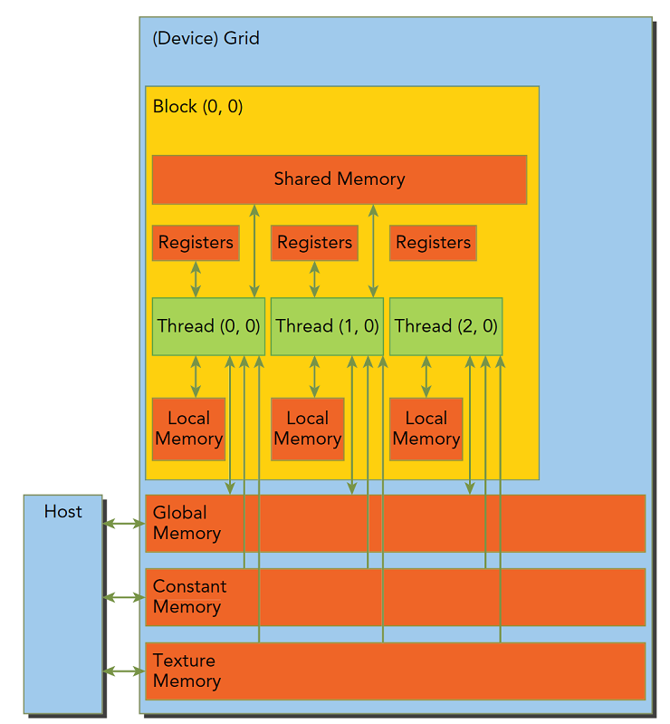

# CUDA内存模型

## 内存层次结构的优点

程序具有局部性特点，包括：

- 时间局部性：就是一个内存位置的数据某时刻被引用，那么在此时刻附近也很有可能被引用，随时间流逝，该数据被引用的可能性逐渐降低。
- 空间局部性：如果某一内存位置的数据被使用，那么附近的数据也有可能被使用。


速度最快的是寄存器，他能和cpu同步的配合，接着是缓存，在CPU片上，然后是主存储器，现在常见的就是内存条，显卡上也有内存芯片，然后是硬盘，这些内存设备的速度和容量相反，越快的越小，越慢的越大。

CPU和GPU的主存都是采用DRAM——动态随机存取存储器，而低延迟的内存，比如一级缓存，则采用SRAM——静态随机存取存储器。虽然底层的存储器延迟高，容量大，但是其中有数据被频繁使用的时候，就会向更高一级的层次传输，比如我们运行程序处理数据的时候，程序第一步就是把硬盘里的数据传输到主存里面。

## CUDA内存模型

分类内存的方法有很多中，但是对于我们来说最一般的分法是：

- 可编程内存：可以使用代码来控制这组内存的行为
- 不可编程内存：不对用户开放的，也就是说其行为在出厂后就已经固化了

对于不可编程内存，我们能做的就是了解其原理，尽可能的利用规则来加速程序，但对于通过调整代码提升速度来说，效果很一般。CPU内存结构中，一级二级缓存都是不可编程（完全不可控制）的存储设备。

GPU 上的内存和缓存:


GPU上的内存设备有：

- 寄存器（register）
- 共享内存（shared memory）
- 局部内存（local memory）
- 常数内存（constant memory）
- 纹理内存（texture memory）
- 全局内存（global memory）



在GPU中，每一个thread拥有自己的register和local memory；每一个block拥有一块shared memory；grid中所有的thread都可以访问同一块global memory。除此之外，constant memory和texture memory是可以被所有thread访问的只读内存，目的是为不同的应用进行优化。

下表给出了各种内存的位置、访问权限、变量生存周期等（register和shared memory都是GPU片上的高速储存器，不支持cache）。


优缺点分析：


当定义一个变量时，该变量将分配在GPU的何种内存上的说明：


### 寄存器（register）

register是GPU片上的高速缓存器，执行单元可以以极低的延迟访问register。寄存器的基本单元是register file，根据GPU型号的不同，每个register file的大小（如32bit）和每个SM中register file的数量（如16384或32768个）不同。虽然register file数量很可观，但平均分给并行执行的thread，每个thread拥有的数量就非常有限了。用register开辟的变量是thread私有的，编程时，不要为每个thread分配过多的私有变量，不然register放不下的变量会放在读写较慢的local memory上，增加读写耗时。

在下面这段kernel代码中，start、end、i等变量都是寄存器变量，传入的参数width会被放在constant memory中：

```
__global__ void registerDemo(int width)
{
  int start = width * threadIdx.x;
  int end   = start + width;
 
  for (int i = start; i < end; i++) {
    // some codes here
  }
}
```

### 局部内存（local memory）

local memory对于每个thread也是私有的，由于其存在于GPU显存之中，因此读写的速度很慢。当block内分配给每个thread的register被消耗完，或声明了大型结构体和数组，或编译器无法确定数组的大小，thread私有的数据将被存在local memory中。编程时，应当尽量避免使用读写速度很慢的local memory。

在下面这段代码中，localMemoryDemo1里的data[3]会被存入local memory中；但在localMemoryDemo2中，定义线程私有数组的同时就进行初始化，且数组尺寸不大，那么这个数组就有可能被分配到寄存器中。如果一定要把较小的数组分配在寄存器中，可以参考localMemoryDemo3中的方法。

```
__global__ void localMemoryDemo1( )
{
  unsigned int data[3];
}
 
__global__ void localMemoryDemo2( )
{
  unsigned int data[3] = {1, 2, 3};
}
 
__global__ void localMemoryDemo3( )
{
  unsigned int data1, data2, data3;
}
```

### 共享内存（shared memory）

shared memory也是GPU片内的高速缓存器，它是一块可以被同一个block中所有thread访问的可读写内存。访问shared memory的速度几乎和访问register一样快，是实现线程间通信的延迟最小的方法。shared memory可以用于实现多种功能，如用于保存公用的计数器（一个block内）或者block的其他公用结果。不同型号GPU每个SM内的shared memory大小不同，编程时需要查一下所使用GPU支持的SM内最大shared memory。

在下面这段代码中，sharedMemoryDemo1演示了对shared memory的动态分配，数组的大小将在kernel启动时通过其执行参数（gridsize和blocksize之后的第三个参数）确定；sharedMemoryDemo2演示了静态分配，这种方式与CPU端静态申请数组时一样，不能使用一个不定值来确定数组大小。申请的shared memory不能在定义时初始化，需要在定义后再进行。

```
// 动态声明
__global__ void sharedMemoryDemo1( )
{
  extern __shared__ float shared_data_dynamic[];
  float *data = (float*)shared_data_dynamic;
 
  int id = threadIdx.x;
  data[id] = 0.0f; // 初始化
}
 
// 静态声明
__global__ void sharedMemoryDemo2( )
{
  __shared__ int shared_data_static[16];
 
  int id = threadIdx.x;
  shared_data_static[id] = 0; // 初始化
}
 
int main(int argc, char** argv)
{
  int length = 16;
  sharedMemoryDemo1<<<1, length, length * sizeof(float)>>>();
  sharedMemoryDemo2<<<1, length>>>();
 
  return 0;
}
```

shared memory上动态分配多个变量时，这种方式定义的所有变量都开始于相同的地址，因此数组中的变量布局必须通过偏移量显示管理。下面的代码给出了一个多变量动态分配的样例。

```
__global__ void sharedMemoryDemo3( )
{
  extern __shared__ char shared_data[];
 
  double* data1 = (double*)shared_data;
  float*  data2 = (float*)&data1[128];
  int*    data3 = (int*)&data2[64];
 
  // 初始化
  int id = threadIdx.x;
  if (id < 128) {
    data1[id] = 0.0f;
  }
  if (id < 64) {
    data2[id] = 0.0f;
  }
  data3[id] = 0;
}
 
int main(int argc, char** argv)
{
  // 在GPU的shared memory上动态分配如下三个数组
  double data1[128];
  float  data2[64];
  int    data3[256];
 
  sharedMemoryDemo3<<<1, 256, 128 * sizeof(double) + 64 * sizeof(float) + 256 * sizeof(int)>>>();
}
```

###  全局内存（global memory）

global memory位于GPU显存（占据了显存的绝大部分），CPU、GPU都可以进行读写访问。整个grid中的任意thread都能读写global memory的任意位置。在目前的架构中，global memory没有缓存，虽然其能提供很高的带宽，但同时也有较高的访问延迟。要有效地利用global memory带宽，必须遵守和并访问要求，并避免分区冲突。

global memory通常使用cudaMalloc()函数分配，cudaFree()函数释放，并由cudaMemcpy()进行host与device的数据传输。通过CUDA API分配的空间未经过初始化，初始化global memory需要调用cudaMemset()函数。对于二维、三维数组，可以使用cudaMallocPitch()和cudaMalloc3D()分配线性存储空间。这些函数能够确保分配满足对齐要求，因此在按列访问、使用cudaMemcpy2D()或cudaMemcpy3D与其他device内存进行拷贝时都能获得最佳性能。下面的代码是分配、拷贝、释放各种global memory上数组的示例。

```
__global__ void globalMemoryDemo1(float* A)
{
  int i = threadIdx.x;
  A[i] *= 2.0f;
}
 
__global__ void globalMemoryDemo2(float* B, size_t pitch, int width, int height)
{
  for (int r = 0; r < height; r++) {
    float* row = (float*)((char*)B + r * pitch);
    for (int c = 0; c < width; c++) {
      float tmp = row[c];
    }
  }
}
 
__global__ void globalMemoryDemo3(cudaPitchedPtr pitched_D, cudaExtent extent)
{
  char* D = pitched_D.ptr;
  size_t pitch = pitched_D.pitch;
  size_t slice_pitch = pitch * extent.height;
  for (int k = 0; k < extent.depth; k++) {
    char* slice = D + k * slice_pitch;
    for (int j = 0; j < extent.height; j++) {
      float* row = (float*)(slice + y * pitch);
      for (int i = 0; i < extent.width; i++) {
        float tmp = row[i];
      }
    }
  }
}
 
int main(int argc, char** argv)
{
  // 一维数组
  const int N = 256;
  size_t size = N * sizeof(float);
  float *h_A, *d_A;
 
  h_A = (float *)malloc(size); // 分配host端空间
  for (int i = 0; i < N; i++) {
    h_A[i] = i;
  }
 
  cudaMalloc((void **)&d_A, size); // 分配GPU global memory上的空间
 
  cudaMemcpy(d_A, h_A, size, cudaMemcpyHostToDevice); // 将host的数据拷贝至device
  globalMemoryDemo1<<<1, N>>>(d_A); // 调用kernel，修改d_A里的元素
  cudaMemcpy(h_A, d_A, size, cudaMemcpyDeviceToHost); // 将device的数据拷回host
 
  cudaFree(d_A); //释放global memory
  free(h_A);
 
  // 二维数组
  int width = 32, height = 16;
  float *d_B, *d_C;
  size_t pitch;
 
  cudaMallocPitch((void **)&d_B, &pitch, width * sizeof(float), height); // 分配GPU global memory上的空间
  globalMemoryDemo2<<<1, 1>>>(d_B, pitch, width, height); // 调用kernel，遍历d_B的元素
  cudaMemcpy2DToArray(d_C, 0, 0, d_B, pitch, width * sizeof(float), height, cudaMemcpyDeviceToDevice); //将d_B的数据拷贝给d_C
 
  cudaFree(d_B);
  cudaFree(d_C);
 
  // 三维数组
  cudaPitchedPtr d_D;
  cudaExtent extent = make_cudaExtent(64, 32, 16); // 定义维度变量extent
 
  cudaMalloc3D(&d_D, extent); // 分配GPU global memory上的空间
  globalMemoryDemo3<<<1, 1>>>(d_D, extent); // 调用kernel，遍历d_D的元素
 
  cudaFree(d_D);
}
```

在调用cudaMallocPitch()分配尺寸为width×height的float型二维数组时，该函数会返回经过填充、对齐后的pitch值（单位为Byte）。在device端代码中，如果不将数组首地址转换为char*型，那么每行的偏移量应该是r*pitch/sizeof(float)或r*(pitch>>2)。

在调用cudaMalloc3D()分配尺寸为width×height×depth的float型三维数组时，该函数会返回一个储存了每个维度填充后的偏移量大小的cudaExtent型结构体，并需要在kernel中使用它对数组中的元素寻址。

在由cudaMalloc()等分配的线性空间、CUDA数组，以及使用变量声明的global或constant memory间可以使用cudaMemcpy系列函数进行相互拷贝，这一类函数往往有异步版本。

### 常数内存（constant memory）

constant memory的空间较小，位于GPU的显存，是只读的地址空间，但是拥有cache进行加速，因此适用于储存需要频繁访问的只读参数。当来自同一harf-warp的线程访问constant memory中的同一数据时，如果发生cache命中，那么只需要一个周期就可以获得数据。constant memory拥有的cache可以节约带宽，加快访问速度。每个GPU的constant memory的空间（如64 KB）和每个SM上cache的大小（如8 KB）依GPU型号而定。constant memory是只读的，因此不存在缓存一致性的问题。

定义constant memory时，需要将其定义为全局变量，作用范围为整个程序。下面的代码给出了两种分配constant memory的示例。第一种方法是直接在定义时直接初始化constant memory，然后可以在kernel里直接使用。第二种方法是先定义一个constant数组，然后使用cudaMemcpyToSymbol()等函数进行赋值。此外，作为参数传入kernel的非global memory指针的变量也会被放在constant memory中，因此这个值无法修改，也无法完成cpu端传递修改后参数值的功能。

```
__constant__ int  num = 16; // 方法1
__constant__ int  con_t[16] = {0, 1, 2, 3, 4, 5, 6, 7, 8, 9, 10, 11, 12, 13, 14, 15}; // 方法1
__constant__ char con_p[16]; // 方法2
 
__global__ static void constantMemoryDemo(char* result)
{
  int index = threadIdx.x;
  if (index >= num) {
    return;
  }
  result[index] = con_p[index] + con_t[index];
}
 
int main(int argc, char** argv[])
{
  char h_result[16] = {0};
  char *d_result;
  cudaMalloc((void **)&d_result, 16 * sizeof(char));
 
  char h_con_p[16] = "Let's learn cuda";
  cudaMemcpyToSymbol(con_p, h_con_p, 16 * sizeof(char)); // 方法2
  constantMemoryDemo<<<1, 32>>>(d_result);
  cudaMemcpy(&h_result, d_result, 16 * sizeof(char), cudaMemcpyDeviceToHost);
 
  cudaFree(d_result);
}
```

### 纹理内存（texture memory）

texture memory是显存上只读的内存，由GPU用于纹理渲染的图形专用单元发展而来，具备地址映射、数据滤波、cache等特殊功能。它不是一块专门的存储器，而是牵涉到显存、两级纹理缓存、纹理拾取单元的纹理流水线。由于cache的存在，访问texture memory的速度要优于global memory，因此比较大且只需要读取的数组，可以使用texture memory进行加速。

下面的代码以一维float数组为例介绍了使用纹理内存的四个步骤：

- 声明纹理空间（全局变量）
- 绑定纹理
- 使用
- 解绑

```
// step 1: alloc texture memory
texture<float, 1, cudaReadModeElementType> tex1D_load;
 
__global__ void kernel(float *d_out, int size)
{
    int index;
    index = blockIdx.x * blockDim.x + threadIdx.x;
 
    if (index < size)
    {
        d_out[index] = tex1Dfetch(tex1D_load, index); // step 3: get values of texture memory
        printf("%f\n", d_out[index]);
    }
}
 
int main(int argc, char** argv[])
{
    int size = 120;
    size_t Size = size * sizeof(float);
    float *harray;
    float *d_in;
    float *d_out;
 
    harray = new float[size];
    cudaMalloc((void **)&d_out, Size);
    cudaMalloc((void **)&d_in, Size);
 
    //initial host memory
    for (int i = 0; i < 4; m++)
    {
        printf("i = %d\n", i);
 
        for (int loop = 0; loop < size; loop++)
        {
            harray[loop] = loop + i * 1000;
        }
 
        //copy to d_in
        cudaMemcpy(d_in, harray, Size, cudaMemcpyHostToDevice);
 
        //step 2: bind texture
        cudaBindTexture(0, tex1D_load, d_in, Size); // 0 means no offset
 
        int nBlocks = (Size - 1) / 128 + 1;
        kernel<<<nBlocks, 128>>>(d_out, size); // step 3
 
        // step 4 unbind texture
        cudaUnbindTexture(tex1D_load);
 
        cudaDeviceSynchronize();
    }
 
    delete[] harray;
    cudaUnbindTexture(&tex1D_load);
    cudaFree(d_in);
    cudaFree(d_out);
 
    return 0;
}
```

## GPU上的缓存

constant memory和texture memory拥有cache，除此之外，GPU上还有L1 cache和L2 cache，分别位于SM内和整个GPU中。

### L1缓存（L1 cache）

L1 cache是SM中硬件控制的高速缓存，由缓存替换算法管理，与CPU的L1 cache的工作方式完全相同，程序员不能控制在L1 cache中保留哪些数据或者替换哪些数据。L1 cache是非一致性的，对于读入某SM L1 cache中的数据，用于该L1 cache中引用该数据的地址与其他SM的L1 cache没有任何关系。也就是，L1 cache严格地用于提高对特定数据的访问速度，而非与其他L1 cache内存进行共享。

### L2缓存（L2 cache）

L2 cache是global memory读取的所有数据被高速缓存的地方。L2 cache是保持一致性的，也就是对于GPU的每个SM来说，L2 cache中的地址都是完全相同的。

##  主机端内存

在CUDA中，host memory分为两种：可分页内存（pageable memory）和页锁定内存（pinned memory）。pageable momory即为通过操作系统API（malloc()、new()）分配的空间，而pinned memory始终不会被分配到低速的虚拟内存中，能够保证存在于物理内存中，并且能够通过DMA加速与设备端的通信。CUDA中pageable memory的使用方法与c语言没有区别，下面介绍pinned memory的使用方法。

### 页锁定内存（pinned memory）

如前文所说，pinned memory不会被分配到低速的虚拟内存中，因此有很多好处，如：可以达到更高的host↔device的数据带宽；某些设备支持DMA功能，在执行kernel的同时利用pinned memory进行host与device的通信；在某些GPU上，pinned memory还可以通过zero-copy功能映射到device地址空间，从GPU直接访问，这样就不用在host memory与global momory间进行数据拷贝工作了。

虽然pinned memory能带来诸多好处，但它是系统中的一种稀缺资源。如果分配过多，会导致操作系统用于分页的物理内存变小，系统整体性能下降。

一般的pinned memory通过cudaHostAlloc()和cudaFreeHost()来分配和释放。此外，以下几种特殊的pinned memory进一步扩充了pinned memory的功能。

#### portable memory

portable memory允许不同的CPU thread操作同一块host memory。在使用cudaHostAlloc()分配pinned memory时，加上cudaHostAllocPortable标志，即可使多个CPU thread通过共享一块portable memory实现CPU线程间的通信。一般来说，pinned memory由哪个CPU thread分配，就只有这个CPU thread才能访问这块空间，而使用portable memory减少了CPU线程间的数据传输和通信。

#### write-combined memory

当CPU对一块内存的数据进行处理时，会将这块内存上的数据缓存到CPU的L1、L2 cache中，并且需要监视这块内存中数据的更改，以保证缓存一致性。一般情况下，这种机制可以减少CPU对内存的访问，但是在“CPU生产数据，GPU消费数据”的模型中，CPU只需要写这块数据就行了，此时其实不需要维护缓存一致性，对内存的监视反而会降低性能。

通过write-combined memory，就可以不使用CPU的L1、L2 cache对一块pinned memory中的数据进行缓存，而将cache资源留给其他程序使用。write-combined memory在PCI-E总线传输期间不会被来自CPU的监视打断，有时可以将host↔device传输带宽提高多达40%。在调用cudaHostAlloc()时加上cudaHostAllocWriteCombined标志，就可以将一块pinned memory声明为write-combined memory。

不过，由于对write-combined memroy的访问没有缓存，CPU从write-combined memory上读数据时速度会有所降低。因此最好只将从CPU端只写的数据存放在write-combined memory中。

#### mapped memory

一块mapped memory拥有两个地址，host地址和device地址。也就是说，可以在kernel中直接访问mapped memory中的数据，而不必再在内存和显存间进行数据拷贝，即zero-copy功能。如果kernel只需要对mapped memory进行少量读写，这样做可以减少一些分配显存和数据拷贝的时间。

mapped memory在host的指针可由cudaHostAlloc()函数获得，它的设备端的指针可以通过cudaHostGetDevicePointer()获得。从kernel程序中访问mapped memory时，需要将设备端指针作为参数传入。

并不是所有GPU都能支持mapped memory功能。通过cudaGetDeviceProperties()函数返回的cudaMapHostMemory属性，可以知道设备是否支持mapped memory。如果设备提供支持，可以在调用cudaHostAlloc()时，加上cudaHostAllocMapped标志，将pinned memory映射到device地址空间。

从kernel里直接访问内存可以带来很多好处：无需分配显存空间，也省去了host↔device的数据拷贝，实现了对内存的zero-copy access。数据传输会根据kernel需要隐式进行，无须使用流，数据传输的延时会被自动隐藏。

由于mapped memory可以从CPU和GPU两端访问，所以必须通过同步来保证CPU和GPU对同一块内存操作的顺序一致性。可以使用流和事件来防止读后写，写后读，以及写后写等错误。对mapped memory的访问也应该满足与global memory相同的合并访问要求，以获得最佳性能。

当多个host thread操作一块portable memory同时也是mapped memory时，每一个host thread都必须调用cudaHostGetDevicePointer()获得这一块pinned memory的device指针。此时，这一块pinned memory在每个host端 thread都有一个device指针。

需要注意的是，应该在执行mapped memory各种操作前，先调用cudaSetDeviceFlags()并加cudaDeviceMapHost标志，进行mapped memory映射。否则调用cudaHostGetDevicePointer()函数时会返回一个错误。

下面的代码是分配各种pinned memory的示例。

```
int main(int argc, char** argv[])
{
  const int n = 64;
  size_t size = n * sizeof(int);
 
  int *data1, *data2, *data3, *data4;
  int *d_data4;
 
  // alloc pinned memory
  cudaHostAlloc((void **)&data1, size, cudaHostAllocDefault);
 
  // alloc portable memory
  cudaHostAlloc((void **)&data2, size, cudaHostAllocPortable);
 
  // alloc write-combined memory
  cudaHostAlloc((void **)&data3, size, cudaHostAllocWriteCombined);
 
  // alloc mapped memory
  cudaDeviceProp prop;
  int flag, device_id = 0;
  cudaGetDeviceProperties(prop, device_id);
  if (prop.canMapHostMemory) {
    cudaHostAlloc((void **)&data4, size, cudaHostAllocMapped);
    cudaHostGetDevicePointer(&d_data4, data4, flag);
  }
   
  // free
  cudaFreeHost(data1);
  cudaFreeHost(data2);
  cudaFreeHost(data3);
  if (prop.canMapHostMemory) {
    cudaFreeHost(data4);
    cudaFree(d_data4);
  }
 
  return 0
}
```


