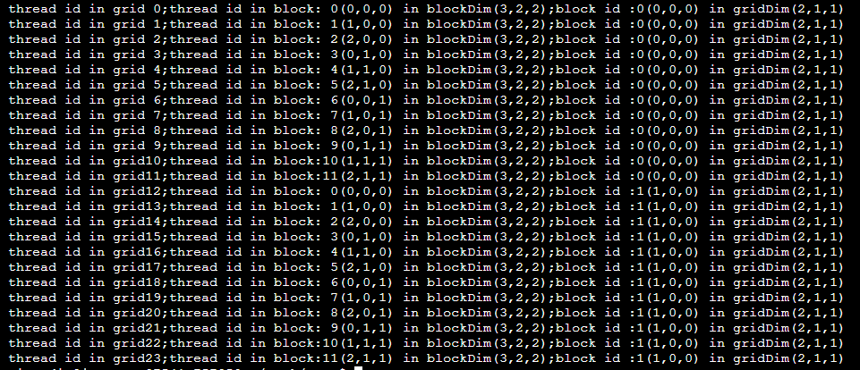

# CUDA编程入门

## helloWorld

```
#include <cstdio>

__global__ void helloWorldKernel()
{
	printf("hello world from gpu\n");
}

__global__ void helloWorldwithThreadKernel()
{
	printf("hello world from gpu block:%d thread：%d \n",blockIdx.x,threadIdx.x);
}


int main()
{
 	printf("hello world from cpu\n");
    printf("--------------------------------------------------\n");

    helloWorldKernel<<<1,10>>>();
    cudaDeviceSynchronize();
    printf("--------------------------------------------------\n");

    helloWorldwithThreadKernel<<<4,2>>>();
    cudaDeviceSynchronize();
    printf("--------------------------------------------------\n");
    
    return 0;
}
```

编译执行：

```
nvcc -ccbin g++ helloWorld.cu -o helloWorld
./helloWorld
```

运行结果：


对于第一个kernel“helloWorldKernel”，main函数调用时在函数名和括号中间加入了`<<<1, 10>>>`，从而指定了这个kernel将发起1个block，每个block中发起10个thread。

同时，在函数实现部分，需要在 `void helloWorldKernel` 前加入`__global__`，这表明该函数是一个在GPU上执行的kernel函数。在CUDA中，所有CPU端调用的kernel函数都必须是void类型，并在void前加入`__global__`。这是CUDA程序调用kernel不同于调用普通函数的特殊语法。事实上，`<<< >>>`中一共有四个参数，依次是gridDim、blockDim、shared Memory size、stream ID，第三个和第四个参数不填时都默认是0，有需要时再进行指定即可。

由于我们在第一个kernel中设定了1×10共10个线程，所以我们可以在屏幕上看到10句Hello World from GPU，这已经是GPU多线程并行执行给出的结果了。

在第二个kernel“helloWorldwithThreadKernel”中，进一步输出了当前线程的blockID和threadID。由于我们设定的是4个block，每个block中2个thread，可以看到输出时有4×2共8个线程分别输出了对应且不同的blockID和threadID组合。

“cudaDeviceSynchronize();”是在CPU端执行了一次CPU和GPU的同步，这样可以避免GPU中Hello World还没输出到屏幕时，main函数里已经执行到“return 0”退出程序。

## checkDimension

```
#include <cstdio>

__global__ void checkIndexKernel()
{
        int threadID = threadIdx.x + threadIdx.y * blockDim.x + threadIdx.z * blockDim.x * blockDim.y;
        int blockID = blockIdx.x + blockIdx.y * gridDim.x + blockIdx.z * gridDim.x * gridDim.y;
        int threadDinGrid = threadID + blockID * blockDim.x * blockDim.y * blockDim.z;

        printf("thread id in grid%2d;thread id in block:%2d(%d,%d,%d) in blockDim(%d,%d,%d);block id :%d(%d,%d,%d) in gridDim(%d,%d,%d)\n",
                threadDinGrid,
                threadID,threadIdx.x,threadIdx.y,threadIdx.z,blockDim.x,blockDim.y,blockDim.z,
                blockID,blockIdx.x,blockIdx.y,blockIdx.z,gridDim.x,gridDim.y,gridDim.z
                );
}

int main()
{
        dim3  block_size(3,2,2);
        dim3  grid_size(2);
        
        checkIndexKernel<<<grid_size,block_size>>>();
        cudaDeviceSynchronize();
        
        return 0;
}
```

编译执行：

```
nvcc -ccbin g++ checkDimension.cu -o checkDimension
./checkDimension
```

运行结果：



在源码中，采用了两个dim3类型的变量block_size和grid_size来控制grid和block的维度。dim3是CUDA程序自带的数据类型，初始化的方式有如下两种：

```
dim3 block_size(3, 2, 2);
dim3 grid_size;
grid_size.x = 2;
grid_size.y = 1; // 不写这句话grid_size.y也等于1
grid_size.z = 1;
```

初始化时没有空缺的维度将默认初始化为1。因此程序中grid_size(2)实际表示的是2×1×1的划分。

发起kernel时，`<<<>>>` 内可以直接使用dim3类型的变量指定gridDim和blockDim，在上面的程序中，将发起（2×1×1）共2个block，每个block中发起（3×2×2）共12个thread。

## ArraySum

```
#include <iostream>
#include <random>
#include <cuda_runtime_api.h>


double* InitializeArray(const int length,const int seed)
{
        double* A = (double*)malloc(length * sizeof(double));
        std::default_random_engine e;
        std::uniform_real_distribution<double> dist(0,10);
        e.seed(seed);

        for(int i=0;i<length;++i)
                A[i] = dist(e);
        return A;
}


void printArray(double* A,const int length,const std::string& str)
{
        std::cout<<"Array "<< str << ":";
        for(int i=0;i<length;++i)
                std::cout<<" "<<A[i];
        std::cout<<std::endl;
}

double* ArraySum(double* A,double* B,const int length)
{
        double* C = (double*)malloc(length*sizeof(double));
        for(int i=0;i<length;++i)
                C[i] = A[i] + B[i];
        return C;
}

__global__ void ArraySumKernel(double *A, double *B, double *C)
{
        int i = threadIdx.x;
        C[i] = A[i] + B[i];
}

int main()
{
        const int length = 10;
        const size_t size = length * sizeof(double);

        double *h_A,*h_B,*h_C;
        h_A = InitializeArray(length, 0);
        h_B = InitializeArray(length, 10);
        h_C = (double*)malloc(size);

        printArray(h_A,length,"A");
        printArray(h_B,length,"B");

        std::cout<<"CPU Array Sum Result:\n";
        printArray(ArraySum(h_A,h_B,length),length,"C");

        std::cout<<"GPU Array Sum Result:\n";
        const int dev = 0;
        cudaSetDevice(dev);

        double *d_A,*d_B,*d_C;
        cudaMalloc((void **)&d_A,size);
        cudaMalloc((void **)&d_B,size);
        cudaMalloc((void **)&d_C,size);

        cudaMemcpy(d_A,h_A,size,cudaMemcpyHostToDevice);
        cudaMemcpy(d_B,h_B,size,cudaMemcpyHostToDevice);
        ArraySumKernel<<<1, length>>>(d_A, d_B, d_C);
        cudaMemcpy(h_C, d_C, size, cudaMemcpyDeviceToHost);
        printArray(h_C, length, "C");


       free(h_A);
       free(h_B);
       free(h_C);

       cudaFree(d_A);
       cudaFree(d_B);
       cudaFree(d_C);

        return 0;
}
```

编译执行：

```
nvcc -ccbin g++ arraySum.cu -o arraySum -std=c++11
./arraySum
```

运行结果：


上述输出说明数组相加在CPU上和GPU上执行的结果是一致的（这也是绝大多数CUDA程序必须保证的一点）。

在GPU计算部分，程序首先用cudaSetDevice指定了使用的GPU编号。一般来说，在只有一块GPU的系统里，该GPU的编号默认为0，此时无须用cudaSetDevice也可以直接使用这块GPU。在多GPU的系统中，则可以直接指定对应编号的GPU进行计算，这些GPU的编号一般为0、1、2、…、N-1。

在CPU端申请了h_A、h_B、h_C三个动态数组指针之后，程序对应地申请了d_A、d_B、d_C三个指针用来指向GPU上的global memory。特别指出，一般CUDA程序中在CPU和GPU上表意相同的变量往往在变量名前分别加上“h_”和“d_”区分这是在host上还是在device上的变量。

对于d_A、d_B、d_C，采用cudaMalloc的runtime API在GPU上申请指定大小的内存空间。为了能顺利调用这个API，需要加入`#include cuda_runtime_api.h` （几乎所有的CUDA程序都需要include它）。

申请好空间后，通过cudaMemcpy将h_A和h_B的数据拷贝到d_A和d_B中，这样GPU上就拥有了需要计算的数据。

ArraySumKernel则很简单，根据数组的length创建对应数量的thread，每个thread分别计算对应的C[i] = A[i] + B[i]。也就是ArraySumKernel实现了对“for (int i = 0; i < length; ++i)”的并行。

计算结束后，仍然使用cudaMemcpy将计算好的d_C数据拷回h_C中，这样就得到了通过GPU计算的正确结果。

在完成整个程序的计算后，不要忘记free CPU内存指针和使用cudaFree释放指向global memory的指针。


