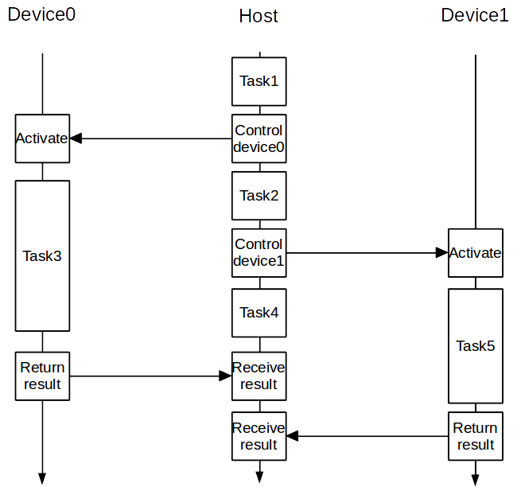
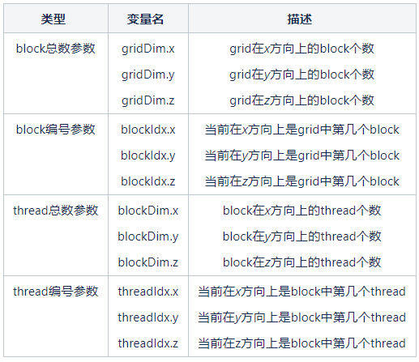
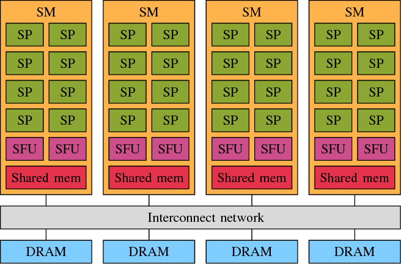

# CUDA编程模型

将计算任务分解成若干子任务分别交给CPU和GPU。如下图所示，Host和Device有各自的流水线，计算和内存等均彼此独立，不过Device依然由Host控制，控制Device的工作也是Host流水线上的一部分。



虽然在大多数时候，为了结果的正确性需要经常在必要处进行Host与Device同步（往往是CPU、GPU间的数据通信），此时CPU或GPU会空等另一边执行到同步出再继续计算。但在此基础上进行进一步优化往往可以带来很好的优化效果，比如采用通信隐藏、或者插入无关计算等方法。

## kernel函数的结构

CUDA中，运行在GPU上的并行计算函数称为kernel函数。kernel函数的结构是初学CUDA时的重点，需要分别理解grid、block、thread的概念和层级结构，然后基于此去理解如线程同步的范围、各种内存的生存周期等重要概念。

如下图所示，kernel函数是以线程网格（grid）的形式组织的，每个grid由若干个线程块（block）组成，而每个block又由若干个线程（thread）组成。

实质上，kernel是以block为单位执行的，引入grid只是用来表示一系列可以并行执行的block的集合。一般来说，一个kernel对应一个grid，对于支持DX11及更高版本的GPU，允许在一个kernel里存在多个不同的grid。通过CUDA里的流（stream），可以在GPU上同时跑多个kernel。

一个grid中的各block是并行执行的，block间没有执行顺序。目前，CUDA不支持block间的直接通信，block间的数据传递必须经过global memory中转。

block内的thread是执行计算的基本单位，一般一个block内最多可以发起1024个thread，有些卡可能最多支持768个，有些可能已经可以支持超过1024个thread。


为了方便编程，CUDA中使用了dim3类型（dim3是基于unit3定义的矢量类型，相当于由3个unsigned int型组成的结构体）的内建变量blockDim、threadIdx、gridDim和blockIdx作为每个thread独立的参数，每个变量都可以是一维、二维或三维的，其代表的具体意义见下表：



调用kernel时最基本的执行参数就是要指定block和thread的维度和每一维的长度，如：

```
// 一维
dim3 blockNum(16); // 等同于blockNum.x = 16; blockNum.y = 1; blockNum.z = 1;
dim3 threadNum(512); // 等同于threadNum.x = 512; threadNum.y = 1; threadNum.z = 1;
kernelsample1d<<<blockNum, threadNum>>>();
 
// 二维
dim3 blockNum(4, 4); // 等同于blockNum.x = 4; blockNum.y = 4; blockNum.z = 1;
dim3 threadNum(128, 4); // 等同于threadNum.x = 128; threadNum.y = 4; threadNum.z = 1;
kernelsample2d<<<blockNum, threadNum>>>();
 
// 三维
dim3 blockNum(4, 2, 2); // 等同于blockNum.x = 4; blockNum.y = 2; blockNum.z = 2;
dim3 threadNum(16, 8, 4); // 等同于threadNum.x = 16; threadNum.y = 8; threadNum.z = 4;
kernelsample3d<<<blockNum, threadNum>>>();
```

这里分别给出了一维、二维和三维时分别共发起16个block，每个block内发起512个thread的执行参数设定示例。对于非三维的情况，调用kernel时的执行参数可以省略不存在的维度，比如`kernelsample1d<<16, 512>>>();`就是直接发起了一维的16个block和每个block内512个thread。

具体来说不同维度 grid 、block 的线程id计算方法：

**grid 一维，block 一维:**

```
int threadId = blockIdx.x * blockDim.x + thradIdx.x;
```

**grid 一维，block 二维:**

```
int threadId = blockIdx.x * blockDim.x * blockDim.y + threadIdx.y * blockDim.x + threadIdx.x;
```

**grid 一维，block 三维:**

```
int threadId = blockId.x * blockDim.x * blockDim.y * blockDim.z + 
			  threadIdx.z * blockDim.x * blockDim.y +
			  threadIdx.y * blockDim.x +
			  threadIdx.x;
```

**grid 二维，block 一维:**

```
int blockId = blockIdx.y * gridDim.x + blockIdx.x;
int threadId =  blockId * blockDim.x + threadIdx.x;
```

**grid 二维，block 二维:**

```
int blockId = blockIdx.y * gridDim.x + blockIdx.x;
int thradId = blockId * blockDim.x * blockDim.y + 
			 threadIdx.y * blockDim.x +
			 threadIdx.x;
```

**grid 二维，block 三维:**

```
int blockId = blockIdx.y * gridDim.x + blockIdx.x;
int thradId = blockId * blockDim.x * blockDim.y * blockDim.z + 
			 threadIdx.z * blockDim.x * blockDim.y + 
			 threadIdx.y * blockDim.x +
			 threadIdx.x;
```

**grid 三维，block 一维:**

```
int blockId = blockIdx.z * gridDim.x * gridDim.y + blockIdx.y * gridDim.x + blockIdx.x;
int threadId = blockId * blockDim.x + threadIdx.x;
```

**grid 三维，block 二维:**

```
int blockId = blockIdx.z * gridDim.x * gridDim.y + blockIdx.y * gridDim.x + blockIdx.x;
int threadId = blockId * blockDim.x * blockDim.y + 
			  threadIdx.y * blockDim.x + 
			  threadx.x;
```

**grid 三维，block 三维:**

```
int blockId = blockIdx.z * girdDim.x * gridDim.y + blockIdx.y * gridDim.x + blockIdx.x;
int threadId = blockId * blockDim.x * blockDim.y * blockDim.z + 
			  threadIdx.z * blockDim.x * blockDim.y +
			  threadIdx.y * blockDim.x +
			  threadIdx.x;
```

kernel可以在启动时以零成本直接获得这几个内建变量值，即可以无需定义直接在kernel中使用这些变量名。

kernel启动后，会一共发起`TotalBlockNum*TheadNumPerBlock`个thread并行地执行kernel中的代码，也就是说，kernel内只需要写清楚一个thread需要完成的指令，无需再像串行程序一样在这些指令的外层套一个`0～TotalBlockNum*TheadNumPerBlock-1`的for循环了。正因如此，绝大多数时候，每个thread执行kernel内的指令时需要知道自己在全部进程中的编号，有时候则需要知道自己所属block在全部block中的编号。

各种thread编号和block编号的计算方法如下：

```
// 对于指定block内某thread的编号
int threadID = threadIdx.x; // 一维
int threadID = threadIdx.x + threadIdx.y * blockDim.x; // 二维
int threadID = threadIdx.x + threadIdx.y * blockDim.x + threadIdx.z * blockDim.x * blockDim.y; // 三维
 
 
// grid内某block的编号
int blockID = blockIdx.x; // 一维
int blockID = blockIdx.x + blockIdx.y * gridDim.x; // 二维
int blockID = blockIdx.x + blockIdx.y * gridDim.x + blockIdx.z * gridDim.x * gridDim.y; // 三维
 
 
// grid内某thread的编号在三方向的分量
int threadID_x = blockIdx.x * blockDim.x + threadIdx.x; // x方向
int threadID_y = blockIdx.y * blockDim.y + threadIdx.y; // y方向
int threadID_z = blockIdx.z * blockDim.z + threadIdx.z; // z方向
 
// grid内某thread的编号
int threadIDinGird = threadID + blockID * blockDim.x * blockDim.y * blockDim.z;
```

这里的第threadID个thread就相当于在全部任务中的第threadID个子任务，又如`for (i = 0;  i < TotalBlockNum * TheadNumPerBlock - 1;  i++)`中每一个特定的i对应的子任务。一般来说，多维block划分和thread划分是为了获取对应维数threadID的每个分量方便。对于一维数组，不会去采用二维或者三维的thread和block分割，否则确定对应threadID号时比较复杂。

## 硬件映射

GPU中的“计算核心”是SM，每个SM中包含8个SP。如下图所示，每个SM中的8个SP共享一片shared memory。前文提到，每个kernel函数实质是以block为单位执行的，block内的线程需要共享数据，因此它们必须在同一个SM中发射，而block中的每一个thread则被发射到一个SP上执行。这就是通过CUDA使用GPU进行并行计算的基本硬件映射。



虽然一个block必须分配到一个SM中，但是一个SM中同一时刻可以有多个活动的block（active block）在等待执行。在一个SM中发射多个block是为了隐藏延迟，更好地利用执行单元的资源，当一个block进行同步或者访问显存等高延迟操作时，另一个block就可以“乘虚而入”，占用GPU执行资源。限制SM中active block的因素包括：

- SM中的active block数量不超过8个
- 所有active block中的线程束（warp）之和不超过24或32（这也是一个block内最多发起768或1024个thread的原因）
- 所有的active block使用的register和shared memory之和不超过SM中的资源限制

线程束（warp）是CUDA中一个非常重要的概念，在实际运行中，block会被分割为体量更小的warp。warp的大小由GPU的型号决定，但常用的绝大多数GPU的warp是由连续的32个thread组成。例如，每个block中threadID0～31的为一束warp，threadID32～63的为第二束，依此类推。warp中的线程只与threadID有关，而与block的维度和每一维的尺度没有关系。在GPU中实际运行程序时，warp才是真正的执行单位，warp中包含32个thread是因为每发射一条warp指令，SM中的8个SP会把这条指令执行4遍。此外，在内存访问时，会涉及到half-warp的概念，halp-warp由warp中的前16个或后16个thread组成。

SIMD模型（single instruction multiple data）是并行计算中的重要概念，NVidia公司在CUDA中采用了基于SIMD的SIMT（single instruction multiple thread）执行模型。SIMD中向量宽度受到硬件限制（如CPU中的长向量处理器一次最多处理4个double型），是显示的、固定的，数据必须打包成向量后才能被处理。在SIMT中，执行数据的宽度将作为硬件细节被隐藏起来，硬件可以自动地适应不同的执行宽度。例如在CUDA中，一个block是由若干个warp组成，如果按照SIMD的模型来设计，那么每个block的执行宽度必须是一个warp，这将大大降低编程的灵活性。另一个重要的不同是，SIMD的向量中的元素相互之间可以自由通信，因为它们存在于相同的地址空间（如同一个register）；而SIMT中的每个线程的寄存器都是私有的，线程只能通过shared memory和同步机制进行通信。

在SIMT模型中，同一个warp中线程执行的指令是相同的，如果需要控制单个线程的行为，产生的分歧会严重降低效率。因此，kernel中应当尽可能的避免分支。


