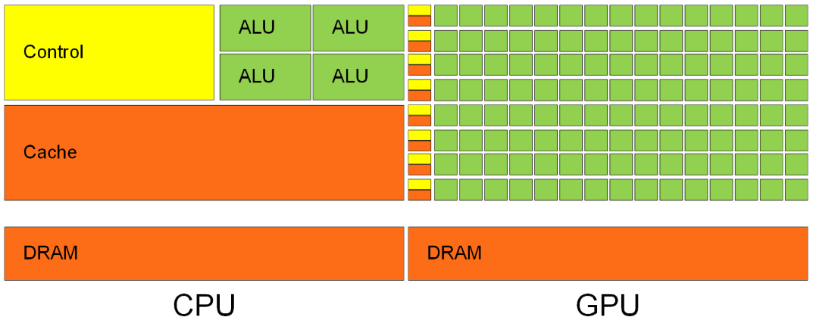
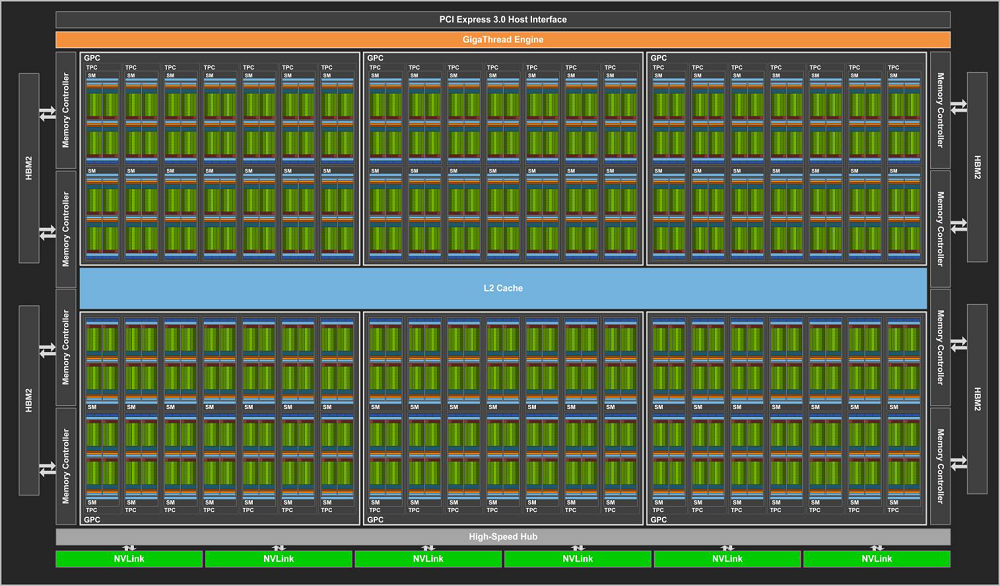
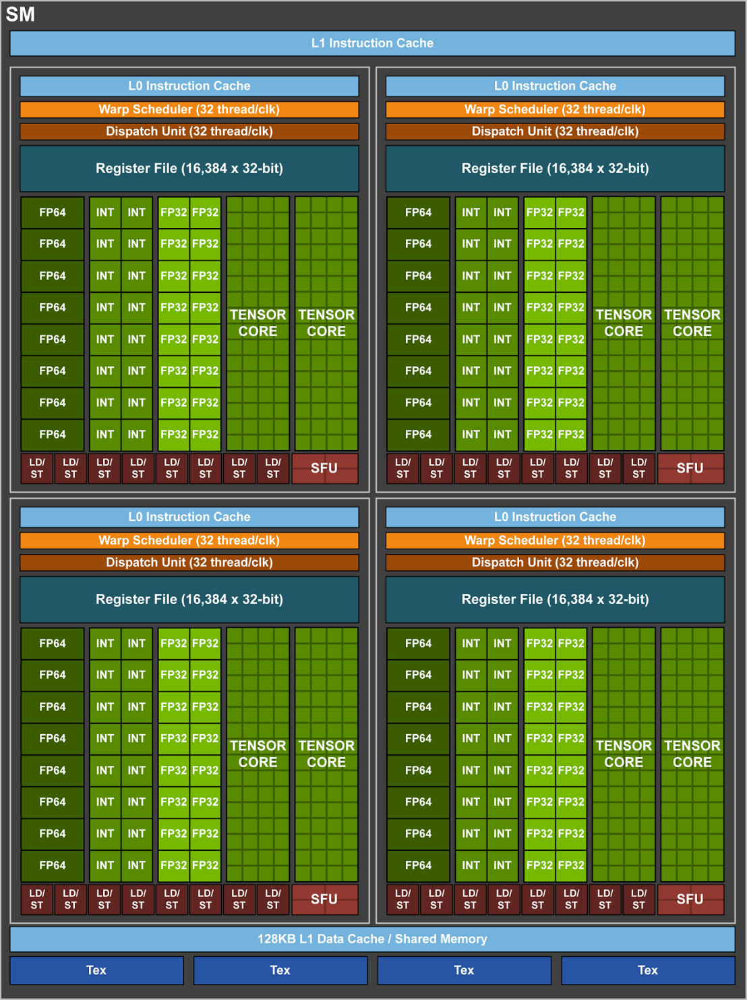
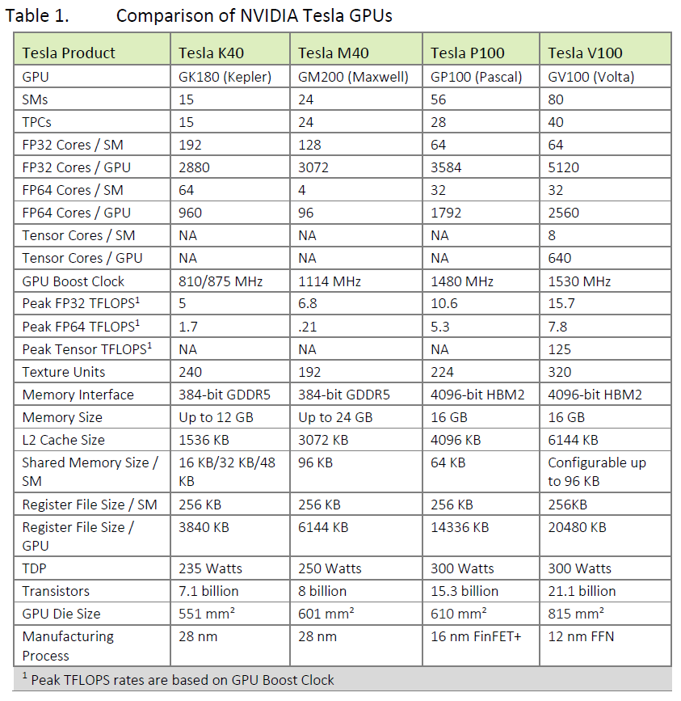

# GPU硬件结构

1999年，NVIDIA公司发布第一款图形处理器（graphic processing unit，GPU），并随后得到广泛的普及。与CPU不同之处在于，GPU的指令集不属于主流CPU的x86架构，虽然GPU的单核频率低于CPU，但更多的计算核心数量使GPU在浮点运算上有着巨大的优势。问世初期，GPU只被用于显示和处理图像。2007年，随着基于GPU的统一计算设备架构（compute unified device architecture，CUDA）的推出，GPU得以在各种计算领域发挥其强大的浮点运算能力，使之成为天然的协处理器。

CPU作为传统处理器，计算核心数较少，每个计算核心有着较高的单核频率，这种结构使CPU擅长于复杂指令调度、分支、逻辑判断和通信等任务。这些任务的逻辑复杂度限制了程序执行的指令并行性。GPU的架构与CPU不同，GPU中所说的核，指的是一个流处理器（stream multiprocessor，SM），每个SM根据GPU型号的不同由若干个标量流处理器（stream processor，SP）组成，SP的功能只有计算。这种架构的优势在于可以容纳上千个没有逻辑关系的数值计算线程进行大量的并行浮点运算，但这种数值运算的并行性在面对逻辑判断执行时却发挥不了优势。

## 显存

显存（video memory）是显卡上的关键部件之一，在CUDA编程中被认为是全局内存（global memory），它的速度和容量直接影响了显卡的性能。除了显存外，GPU上还有其他几种内存，包括寄存器（register）、共享内存（shared memory）、局部内存（local memory）、常数内存（constant memory）、纹理内存（texture memory）等。

此外，每个SM拥有自己的L1缓存（cache），同时所有的SM共同使用L2缓存。

## **GPU芯片**

GPU芯片是GPU的心脏，其独特的结构提供了不同于CPU的强大计算能力。在GPU中，SM类似于CPU的“计算核心”，每个SM中包含8个SP（对于Volta架构，SP被升级为tensor core），是GPU中进行多线程计算的基本执行单元。

以V100卡为例，下面两张图是其内部结构，给出了GPU中计算单元与储存器以及通信协议间的关系，而CUDA正是基于这种结构进行多线程并行计算。V100卡由80个SM组成，每个SM内除了8个tensor core，还有64个FP32 cores和32个FP64 cores。每个GPU的单精度/双精度浮点性能正是通过其拥有的全部FP32/FP64 cores累加而来，对于V100，内部如此多的FP32/FP64 cores体现出了其强大的浮点计算能力。

V100中的80个SM结构：

V100中一个SM内的结构：

## 各代GPU架构

GPU自问世至今，每一代GPU性能的提升主要是通过增加GPU内计算核心的数量来实现。然而，随着核心数量的增加，NVidia公司不得不提出新的方式（即新的架构）来组织核心，因为增加SM的数量显著增加了芯片面积。除此之外，新的架构还提供了单核性能更高的计算核心和更先进GPU软硬件技术。

GPU架构的发展历程为：Fermi（2009）→Kepler（2012）→Maxwell（2014）→Pascal（2016）→Volta & Turing（2018）。下表给出了不同架构的几款指定型号GPU的各项参数对比。从表中可以看到，随着架构不断地升级，GPU内的计算核心、板载内存、缓存等性能指标也在不断地提升。值得一提的是，早期的GPU对双精度浮点数的支持不是很好，双精度峰值性能并不是单精度峰值性能的一半，这是由于早期GPU芯片内的FP64 core数量不足导致的。因此，在使用早期GPU时，使用单精度浮点数计算能得到更好的性能。

由于GPU硬件架构的不断升级（如Volta架构采用了全新的tensor core），以及CUDA中一些技术仅支持某几种特定架构的GPU（如动态并行只支持Pascal及之后的架构），在开发GPU应用时，必须了解所用GPU的架构，从而避免使用该GPU不支持的CUDA技术。

